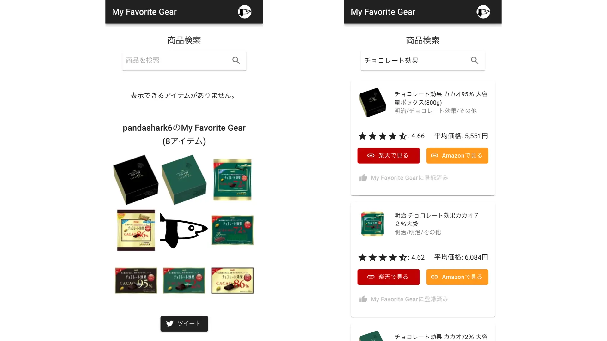

# Pandashark's Portfolio Site

ご覧いただきありがとうございます。Pandasharkの作成物の簡易まとめです。詳細はポートフォリオサイトを閲覧ください。

## Food Blog :star::star::star:

### 概要

Next.jsで作ったレシピブログです。要件として非エンジニアの方がCMSから入稿とサイトの基本設定の変更ができることを想定しています。

### URL

https://food-blog-chi.vercel.app/

### 使用技術・言語

- React, Next.js, TypeScript, Tailwind CSS
- Vercel, microCMS
- MDX, Storybook, Jest

## Portfolio :star::star:

### 概要

転職活動のため作成したポートフォリオサイトです。Next.jsとTypeScriptの学習を兼ねています。

### URL

https://next-portfolio-livid.vercel.app/

### 使用技術・言語

- React, Next.js, TypeScript, CSS Modules
- Vercel
- Storybook, Jest, GitHub Actions

## My Favorite Gear :star::star::star:

### 概要

自分のお気に入りのアイテムを8つ選んでTwitterに投稿できます。

### URL

https://my-favorite-gear.firebaseapp.com/

### 使用技術・言語

- React, TypeScript, Material-UI
- Firebase Hosting, Firestore, Cloud Functions
- webpack 5, Jest

## EC App :star:

### 概要

React-ReduxでWebアプリケーションの作り方を学習するため作成しました。
### URL

https://ec-app-a2f5e.web.app/

### 使用技術・言語

- React, Redux, Material-UI
- Firebase Hosting, Firestore, Cloud Functions

## Chat Bot :star:

### 概要

事前に用意したQAを使って自動応答するチャットボットです。ポートフォリオサイトのヘッダーメニューのロボットアイコンからもお試しいただけます。

### URL

https://chatbot-demo-70752.web.app/

### 使用技術・言語

- React, Material-UI
- Firebase Hosting, Firestore, Cloud Functions

## Author

- [GitHub](https://github.com/x7ddf74479jn5)
- [Twitter](https://twitter.com/pandashark6)
